# MLOps Assignment 2 Report
## Binary Image Classification (Cats vs Dogs) — End-to-End MLOps Pipeline

**Course:** MLOps (S1-25_AIMLCZG523)  
**Assignment:** Assignment II  
**Date:** 2026-02-22

### Group Members

| Student Name | ID |
|---|---|
| Azhar Nekware | 2024AA05736 |
| Anurag Sharma | 2023AC05271 |
| SHIKHAR DALELA | 2023AC05481 |
| NITIN KUSHWAHA | 2024AA05764 |
| POORNIMA T | 2024AA05600 |

<div style="page-break-after: always;"></div>

## Table of Contents
1. [Link to Code Repository](#link-to-code-repository)
2. [M1 — Model Development & Experiment Tracking](#m1--model-development--experiment-tracking)
3. [M2 — Model Packaging & Containerization](#m2--model-packaging--containerization)
4. [M3 — CI Pipeline for Build, Test & Image Creation](#m3--ci-pipeline-for-build-test--image-creation)
5. [M4 — CD Pipeline & Deployment](#m4--cd-pipeline--deployment)
6. [M5 — Monitoring, Logs & Performance Tracking](#m5--monitoring-logs--performance-tracking)
7. [Architecture Diagram](#architecture-diagram)
8. [Tools & Technology Stack](#tools--technology-stack)

<div style="page-break-after: always;"></div>

## Link to Code Repository

**GitHub Repository:** [https://github.com/Azhar-N/Binary_image_classification_Assignment_No_2](https://github.com/Azhar-N/Binary_image_classification_Assignment_No_2)

**Container Registry:** `ghcr.io/azhar-n/catdog-classifier`

<div style="page-break-after: always;"></div>

## Architecture Diagram

```
┌─────────────────────────────────────────────────────────────────────┐
│                      Developer Workstation                           │
│                                                                     │
│  ┌──────────────┐   ┌────────────────┐   ┌───────────────────────┐ │
│  │  Git + DVC   │──▶│  src/train.py  │──▶│  MLflow Tracking UI   │ │
│  │  versioning  │   │  (ResNet-18)   │   │  - params logged      │ │
│  └──────────────┘   └────────────────┘   │  - metrics per epoch  │ │
│                             │            │  - loss_curves.png    │ │
│                             │            │  - confusion_matrix   │ │
│                             ▼            └───────────────────────┘ │
│                    ┌────────────────┐                               │
│                    │ models/*.pt    │  (DVC artifact output)        │
│                    └────────────────┘                               │
└───────────────────────────┬─────────────────────────────────────────┘
                            │  git push → main
                            ▼
┌─────────────────────────────────────────────────────────────────────┐
│                       GitHub Actions CI/CD                           │
│                                                                     │
│  ┌──────────────┐   ┌────────────────┐   ┌───────────────────────┐ │
│  │  Job 1       │──▶│  Job 2         │──▶│  Job 3                │ │
│  │  Run pytest  │   │  docker build  │   │  docker compose up    │ │
│  │  (20 tests)  │   │  + push GHCR   │   │  + smoke_test.sh      │ │
│  └──────────────┘   └────────────────┘   └───────────────────────┘ │
│                             │                                       │
│                             ▼                                       │
│              ghcr.io/azhar-n/catdog-classifier:sha-xxxx             │
└───────────────────────────┬─────────────────────────────────────────┘
                            │  pull & deploy
                            ▼
┌─────────────────────────────────────────────────────────────────────┐
│                   Deployed Stack (Docker Compose)                    │
│                                                                     │
│  ┌───────────────────────────┐   ┌───────────────────────────────┐ │
│  │  catdog-api (FastAPI)     │   │  Prometheus                   │ │
│  │  Port: 8000               │◀─▶│  Port: 9090                   │ │
│  │  GET  /health             │   │  Scrapes /metrics every 15s   │ │
│  │  POST /predict            │   └───────────────────────────────┘ │
│  │  GET  /metrics            │                                     │
│  └───────────────────────────┘                                     │
└─────────────────────────────────────────────────────────────────────┘
```

<div style="page-break-after: always;"></div>

---

## M1 — Model Development & Experiment Tracking

### 1.1 Data & Code Versioning

#### Git — Source Code Versioning
All source code, configuration files, CI/CD definitions, and deployment manifests are tracked in Git with a structured commit history.

#### DVC — Dataset & Pipeline Versioning
DVC tracks the full data pipeline from raw images → processed data → trained model artifacts. The `dvc.yaml` defines two stages:

- **preprocess:** Resizes all images to 224×224 RGB, splits into train/val/test (80/10/10)
- **train:** Trains ResNet-18, logs to MLflow, outputs `.pt` checkpoint + charts

**Hyperparameters tracked in `params.yaml`:**
```yaml
preprocess:
  image_size: 224
  split_ratios: { train: 0.8, val: 0.1, test: 0.1 }

train:
  epochs: 10
  batch_size: 32
  lr: 0.001
  weight_decay: 0.0001
```

Run `dvc repro` to reproduce the full pipeline from scratch. Run `dvc metrics show` to compare runs.

<div style="border:1px solid #ccc; padding:10px; margin:20px 0; text-align:center;">
  <p><strong>Screenshot 1 — Git Repository: Commit History</strong></p>
  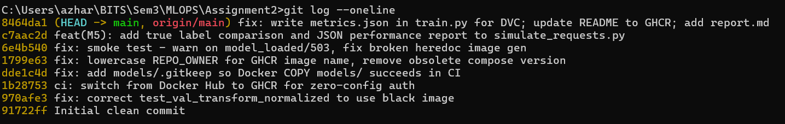
</div>

<div style="border:1px solid #ccc; padding:10px; margin:20px 0; text-align:center;">
  <p><strong>Screenshot 2 — DVC Pipeline DAG</strong></p>
  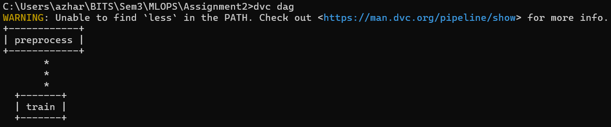 train stages">
</div>

---

### 1.2 Data Preprocessing

**File:** `src/data_preprocessing.py`

The preprocessing pipeline:
1. Reads raw images from `data/raw/cat/` and `data/raw/dog/`
2. Converts all images to RGB (handles RGBA, grayscale, palette images)
3. Resizes every image to **224×224** using LANCZOS resampling
4. Performs reproducible **80/10/10** split (seed=42)
5. Writes processed images to `data/processed/{train,val,test}/{cat,dog}/`

**Training augmentation pipeline (`src/utils.py`):**
```python
transforms.Compose([
    transforms.Resize((224, 224)),
    transforms.RandomHorizontalFlip(p=0.5),
    transforms.RandomRotation(degrees=15),
    transforms.ColorJitter(brightness=0.2, contrast=0.2, saturation=0.2),
    transforms.ToTensor(),
    transforms.Normalize(mean=[0.485, 0.456, 0.406], std=[0.229, 0.224, 0.225]),
])
```

---

### 1.3 Model Architecture

**File:** `src/model.py`

**Backbone:** ResNet-18 pretrained on ImageNet with a custom binary classification head:

```
Input: [B, 3, 224, 224]
  └─▶ ResNet-18 Backbone (pretrained ImageNet weights)
        └─▶ GlobalAvgPool → [B, 512]
              └─▶ Dropout(p=0.3)
                    └─▶ Linear(512 → 1)
Output: [B, 1] logit  →  sigmoid → dog probability
```

| Attribute | Value |
|---|---|
| Architecture | ResNet-18 (transfer learning) |
| Loss | BCEWithLogitsLoss |
| Optimizer | Adam (lr=0.001, weight_decay=1e-4) |
| LR Scheduler | StepLR (step=5, γ=0.5) |
| Threshold | sigmoid ≥ 0.5 → dog, < 0.5 → cat |
| Parameters | ~11.2M |

---

### 1.4 Experiment Tracking — MLflow

**File:** `src/train.py`

Every training run logs to MLflow:

| Category | Items Logged |
|---|---|
| **Parameters** | epochs, batch_size, lr, weight_decay, model, optimizer |
| **Metrics (per epoch)** | train_loss, train_acc, val_loss, val_acc |
| **Metrics (final)** | test_loss, test_acc |
| **Artifacts** | `cat_dog_model.pt`, `loss_curves.png`, `confusion_matrix.png` |
| **Model** | `mlflow.pytorch.log_model()` for registry |

```bash
python src/train.py --epochs 10 --lr 0.001 --run-name baseline-resnet18
mlflow ui   # http://localhost:5000
```

<div style="border:1px solid #ccc; padding:10px; margin:20px 0; text-align:center;">
  <p><strong>Screenshot 3 — MLflow Experiment List</strong></p>
  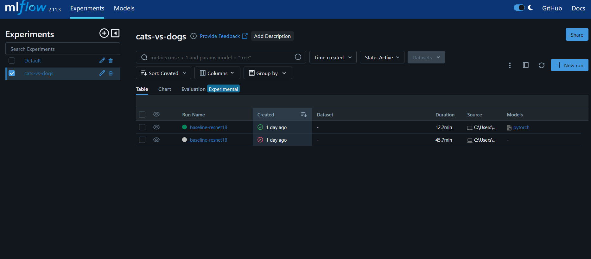
</div>

<div style="border:1px solid #ccc; padding:10px; margin:20px 0; text-align:center;">
  <p><strong>Screenshot 4 — MLflow Run: Parameters & Metrics</strong></p>
  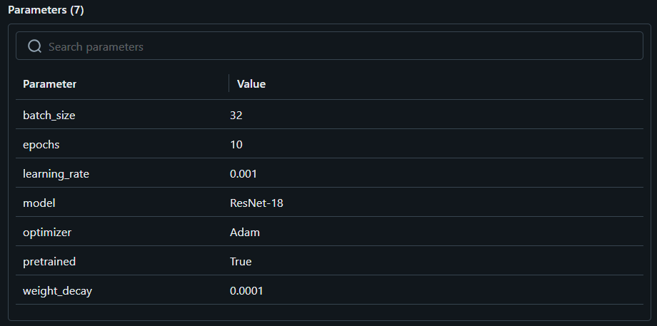
</div>

<div style="border:1px solid #ccc; padding:10px; margin:20px 0; text-align:center;">
  <p><strong>Screenshot 5 — Training & Validation Loss Curves</strong></p>
  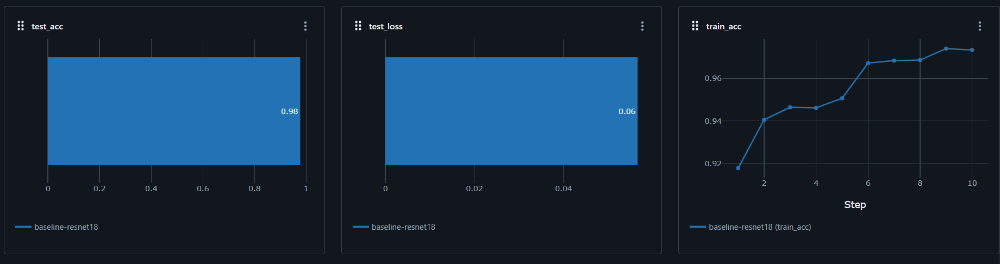
  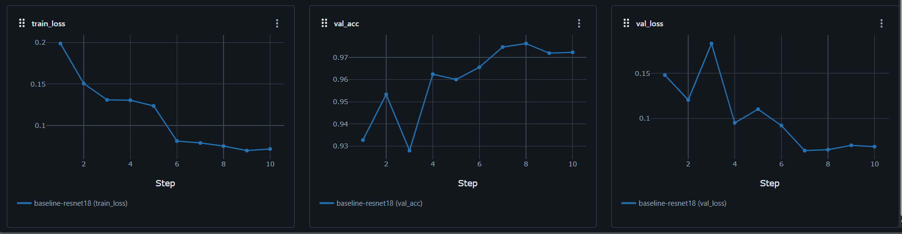
</div>

<div style="border:1px solid #ccc; padding:10px; margin:20px 0; text-align:center;">
  <p><strong>Screenshot 6 — MLflow Metrics Dashboard</strong></p>
  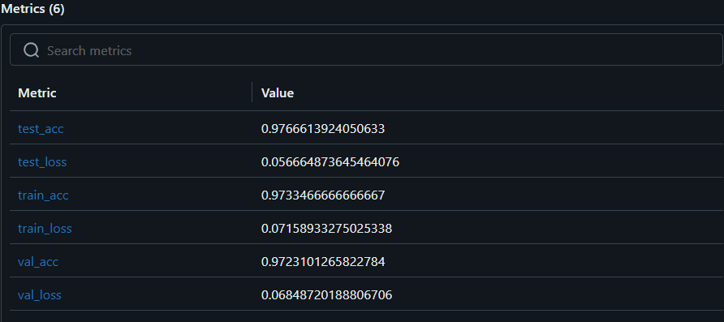
</div>

<div style="page-break-after: always;"></div>

---

## M2 — Model Packaging & Containerization

### 2.1 FastAPI Inference Service

**File:** `app/main.py`

| Method | Endpoint | Description |
|---|---|---|
| `GET` | `/health` | Service status + model_loaded flag |
| `POST` | `/predict` | Upload image → label + probabilities |
| `GET` | `/metrics` | Prometheus metrics (scraped every 15s) |
| `GET` | `/docs` | Auto-generated Swagger UI |

**Health Check Response:**
```json
{ "status": "ok", "model_loaded": true }
```

**Prediction Response:**
```json
{
  "label": "cat",
  "confidence": 0.9231,
  "cat_probability": 0.9231,
  "dog_probability": 0.0769
}
```

```bash
# Health check
curl http://localhost:8000/health

# Prediction
curl -X POST http://localhost:8000/predict -F "file=@cat.jpg"
```

<div style="border:1px solid #ccc; padding:10px; margin:20px 0; text-align:center;">
  <p><strong>Screenshot 7 — FastAPI Swagger UI (/docs)</strong></p>
  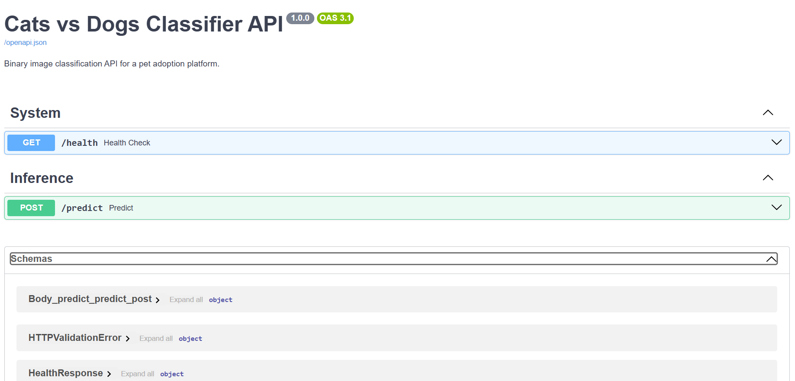
</div>

<div style="border:1px solid #ccc; padding:10px; margin:20px 0; text-align:center;">
  <p><strong>Screenshot 8 — GET /health Response</strong></p>
  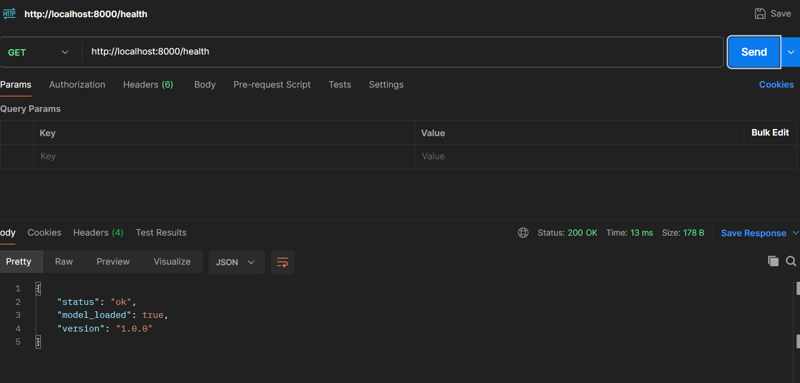
</div>

<div style="border:1px solid #ccc; padding:10px; margin:20px 0; text-align:center;">
  <p><strong>Screenshot 9 — POST /predict Response</strong></p>
  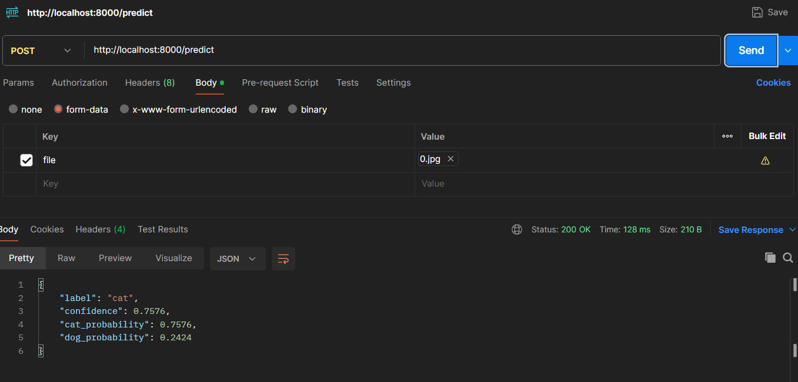
</div>

---

### 2.2 Environment Specification

**File:** `requirements.txt` — All key library versions pinned:

```
torch==2.2.0          torchvision==0.17.0
fastapi==0.109.2      uvicorn[standard]==0.27.1
mlflow==2.10.2        dvc==3.40.1
prometheus-client==0.20.0
pytest==8.0.1         Pillow==10.2.0
numpy==1.26.4         scikit-learn==1.4.0
```

---

### 2.3 Dockerfile — Multi-Stage Build

**File:** `Dockerfile`

Two-stage build separates build tools from the runtime image:

```dockerfile
# Stage 1: Builder (installs packages with gcc/g++)
FROM python:3.10-slim AS builder
RUN apt-get install gcc g++
RUN pip install --no-cache-dir --user -r requirements.txt

# Stage 2: Runtime (no build tools — smaller image)
FROM python:3.10-slim AS runtime
COPY --from=builder /root/.local /root/.local
COPY app/ src/ models/ ./
EXPOSE 8000
CMD ["uvicorn", "app.main:app", "--host", "0.0.0.0", "--port", "8000"]
```

```bash
# Build locally
docker build -t catdog-classifier:local .

# Run with model volume-mounted
docker run -p 8000:8000 \
  -v ${PWD}/models:/app/models:ro \
  -e MODEL_PATH=/app/models/cat_dog_model.pt \
  catdog-classifier:local
```

<div style="border:1px solid #ccc; padding:10px; margin:20px 0; text-align:center;">
  <p><strong>Screenshot 10 — Docker Build Output</strong></p>
  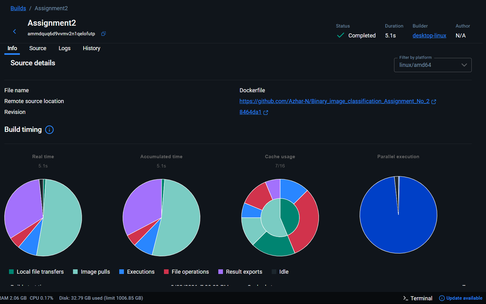
</div>

<div style="border:1px solid #ccc; padding:10px; margin:20px 0; text-align:center;">
  <p><strong>Screenshot 11 — Docker Container Running Locally</strong></p>
  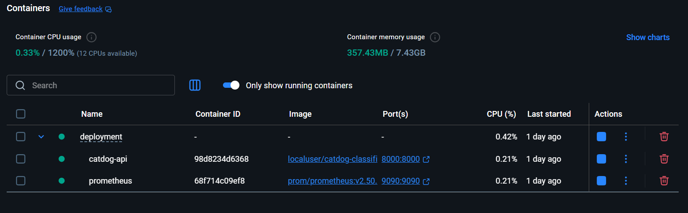
</div>

<div style="page-break-after: always;"></div>

---

## M3 — CI Pipeline for Build, Test & Image Creation

### 3.1 Automated Testing

**Files:** `tests/test_preprocessing.py`, `tests/test_inference.py`

**20 unit tests** across two modules — all runnable in CI without model artifacts:

**Preprocessing Tests (`test_preprocessing.py`):**

| Test | Verifies |
|---|---|
| `test_resize_to_224` | Output image is exactly 224×224 |
| `test_converts_to_rgb` | RGBA/L images converted to RGB |
| `test_creates_parent_dirs` | Nested destination dirs auto-created |
| `test_finds_jpeg_and_png` | Only image extensions collected |
| `test_recursive_search` | Nested directories searched |
| `test_empty_directory` | Returns empty list correctly |
| `test_split_ratios` | 80/10/10 proportions match exactly |
| `test_no_data_leakage` | No file appears in 2 splits |
| `test_reproducibility` | Same seed → identical split |
| `test_creates_images` | N images per class created |
| `test_images_are_valid` | Dummy images are openable/valid RGB |

**Inference Tests (`test_inference.py`):**

| Test | Verifies |
|---|---|
| `test_output_shape` | Model output shape is `[batch, 1]` |
| `test_output_is_finite` | No NaN/Inf in logits |
| `test_sigmoid_in_range` | All probabilities ∈ [0, 1] |
| `test_val_transform_output_shape` | Tensor shape `[3, 224, 224]` |
| `test_val_transform_normalized` | ImageNet normalization applied |
| `test_all_correct` | Accuracy = 1.0 for perfect predictions |
| `test_all_wrong` | Accuracy = 0.0 for all-wrong predictions |
| `test_half_correct` | Accuracy = 0.5 for half correct |
| `test_end_to_end_inference` | Full PIL→tensor→logit→label pipeline |

```bash
pytest tests/ -v --tb=short
```

<div style="border:1px solid #ccc; padding:10px; margin:20px 0; text-align:center;">
  <p><strong>Screenshot 12 — pytest Passing Locally</strong></p>
  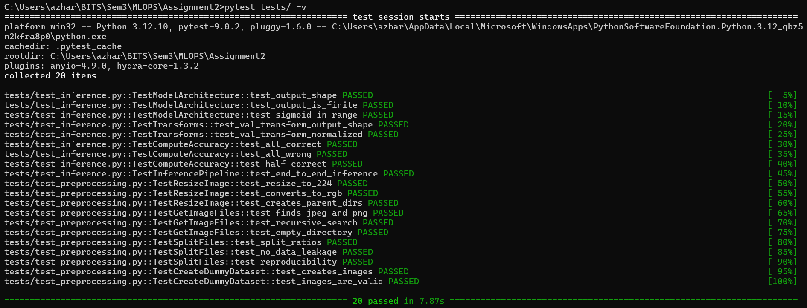
</div>

---

### 3.2 CI Setup — GitHub Actions

**File:** `.github/workflows/ci-cd.yml`

Triggers on every push to `main`/`develop` and every pull request to `main`.

**Job 1 — Unit Tests (all branches + PRs):**
```
Checkout → Python 3.10 → pip install → pytest tests/ → Upload JUnit XML
```

**Job 2 — Build & Push Docker Image (main branch only):**
```
Checkout → Lowercase REPO_OWNER → QEMU + Buildx setup
  → Login GHCR (GITHUB_TOKEN — no secrets needed)
  → docker build → Push ghcr.io/azhar-n/catdog-classifier:sha-<hash>
```

**Job 3 — Deploy & Smoke Test (after Job 2):**
```
docker compose up -d --wait → smoke_test.sh → docker compose down
```

<div style="border:1px solid #ccc; padding:10px; margin:20px 0; text-align:center;">
  <p><strong>Screenshot 13 — GitHub Actions: All Jobs Passing</strong></p>
  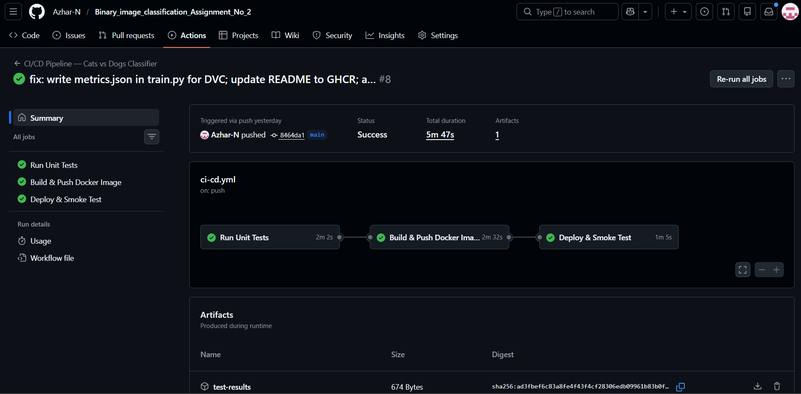
</div>

<div style="border:1px solid #ccc; padding:10px; margin:20px 0; text-align:center;">
  <p><strong>Screenshot 14 — GitHub Actions: Unit Test Job Detail</strong></p>
  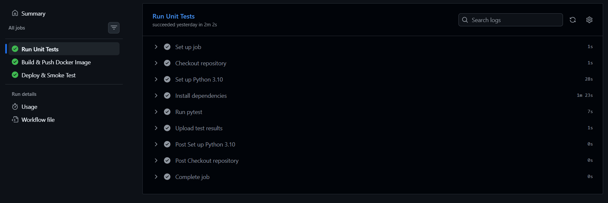
</div>

---

### 3.3 Artifact Publishing — GHCR

Images are tagged and pushed to GitHub Container Registry on every successful main branch build:

```
ghcr.io/azhar-n/catdog-classifier:latest
ghcr.io/azhar-n/catdog-classifier:sha-<git-short-hash>
```

No manual secrets required — uses the automatically-injected `GITHUB_TOKEN`.

<div style="border:1px solid #ccc; padding:10px; margin:20px 0; text-align:center;">
  <p><strong>Screenshot 15 — GHCR: Published Docker Image</strong></p>
  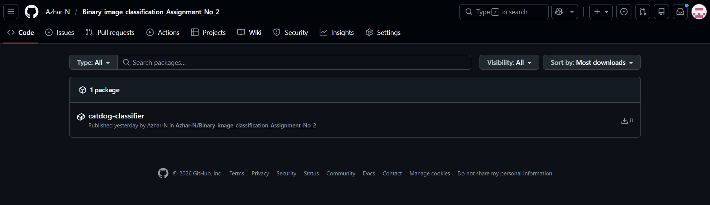
</div>

<div style="border:1px solid #ccc; padding:10px; margin:20px 0; text-align:center;">
  <p><strong>Screenshot 16 — GitHub Actions: Build & Push Job Detail</strong></p>
  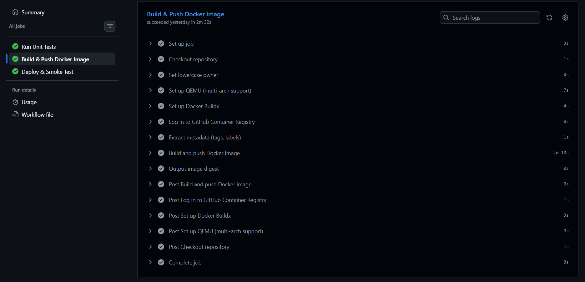
</div>

<div style="page-break-after: always;"></div>

---

## M4 — CD Pipeline & Deployment

### 4.1 Deployment Target — Docker Compose

**File:** `deployment/docker-compose.yml`

Two-service stack deployed for every push to `main`:

```yaml
services:
  catdog-api:
    image: ghcr.io/${REPO_OWNER}/catdog-classifier:${IMAGE_TAG}
    build: { context: .., dockerfile: Dockerfile }  # local dev fallback
    ports: ["8000:8000"]
    volumes: ["../models:/app/models:ro"]  # model mounted at runtime
    healthcheck:
      test: ["CMD", "python", "-c", "urllib.request.urlopen('http://localhost:8000/health')"]

  prometheus:
    image: prom/prometheus:v2.50.1
    ports: ["9090:9090"]
    volumes: ["../monitoring/prometheus.yml:/etc/prometheus/prometheus.yml:ro"]
```

> **Key design:** The `.pt` model file is **volume-mounted**, not baked into the image. This allows model updates without rebuilding the container.

```bash
# Local development (builds from source)
cd deployment
docker compose up -d --build

# Verify
curl http://localhost:8000/health
```

<div style="border:1px solid #ccc; padding:10px; margin:20px 0; text-align:center;">
  <p><strong>Screenshot 17 — docker compose up Output</strong></p>
  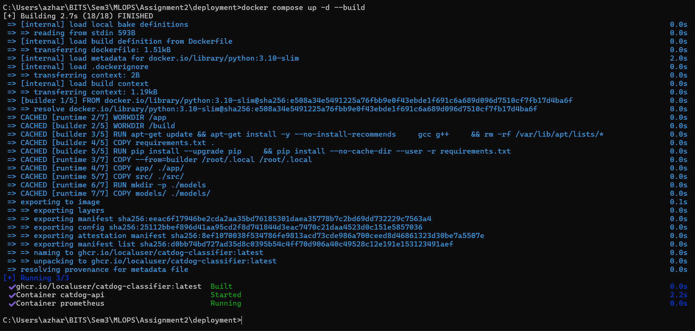
</div>

<div style="border:1px solid #ccc; padding:10px; margin:20px 0; text-align:center;">
  <p><strong>Screenshot 18 — Running Containers (docker ps)</strong></p>
  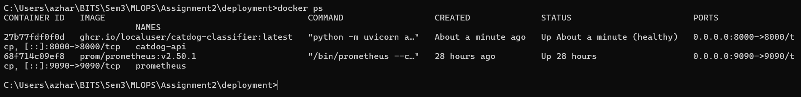
</div>

---

### 4.2 CD/GitOps Flow

Every push to `main` automatically triggers the full pipeline:

```
git push → main
    │
    ▼
Job 1: pytest (20 tests) — must pass
    │
    ▼
Job 2: docker build + push → ghcr.io/azhar-n/catdog-classifier:sha-<hash>
    │
    ▼
Job 3: docker compose up → smoke_test.sh → docker compose down
```

---

### 4.3 Smoke Tests

**File:** `deployment/smoke_test.sh`

Runs automatically post-deploy and fails the pipeline if critical assertions fail:

| Test | Type | Failure Behaviour |
|---|---|---|
| `GET /health` returns 200 | Hard | Pipeline fails |
| `model_loaded` is true | Soft | Warning only (CI has no .pt) |
| `POST /predict` returns 200 | Hard (503 = soft) | Pipeline fails if not 200/503 |
| Response label is "cat" or "dog" | Hard | Pipeline fails on invalid label |

<div style="border:1px solid #ccc; padding:10px; margin:20px 0; text-align:center;">
  <p><strong>Screenshot 19 — Smoke Test Passing</strong></p>
  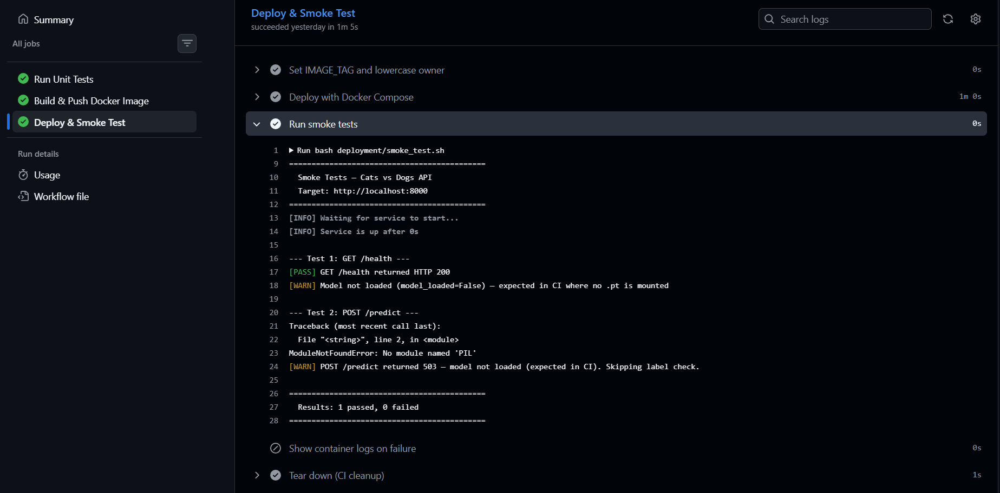
</div>

<div style="page-break-after: always;"></div>

---

## M5 — Monitoring, Logs & Performance Tracking

### 5.1 Request/Response Logging

**File:** `app/main.py`

All requests are logged as structured JSON (no sensitive data):

```python
logging.basicConfig(
    format='{"time": "%(asctime)s", "level": "%(levelname)s", "message": "%(message)s"}',
)
```

**Sample log entry:**
```json
{"time": "2026-02-22 10:15:42", "level": "INFO",
 "message": "predict | label=cat confidence=0.9231 latency=0.042s file=pet.jpg"}
```

What is logged:
- Prediction label and confidence
- End-to-end request latency
- Uploaded filename (not file content)
- Model load success/failure at startup

---

### 5.2 Prometheus Metrics

Three custom metrics are exposed at `GET /metrics`:

| Metric | Type | Labels | Description |
|---|---|---|---|
| `catdog_request_total` | Counter | `endpoint`, `status` | Requests by endpoint + HTTP status |
| `catdog_request_latency_seconds` | Histogram | `endpoint` | Latency distribution (7 buckets) |
| `catdog_prediction_label_total` | Counter | `label` | Cat vs Dog prediction counts |

**Prometheus scrape config (`monitoring/prometheus.yml`):**
```yaml
scrape_configs:
  - job_name: catdog-api
    static_configs:
      - targets: ['catdog-api:8000']
    metrics_path: /metrics
    scrape_interval: 15s
```

<div style="border:1px solid #ccc; padding:10px; margin:20px 0; text-align:center;">
  <p><strong>Screenshot 20 — Prometheus Metrics Endpoint (curl /metrics)</strong></p>
  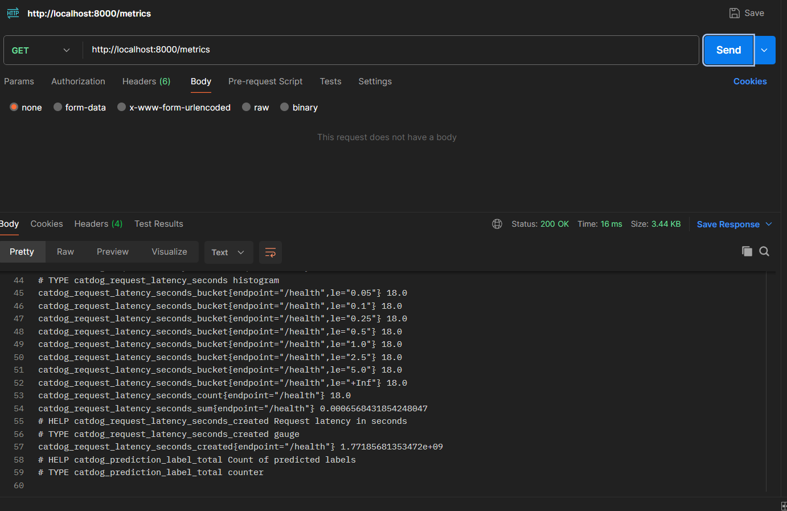
</div>

<div style="border:1px solid #ccc; padding:10px; margin:20px 0; text-align:center;">
  <p><strong>Screenshot 21 — Prometheus UI (http://localhost:9090)</strong></p>
  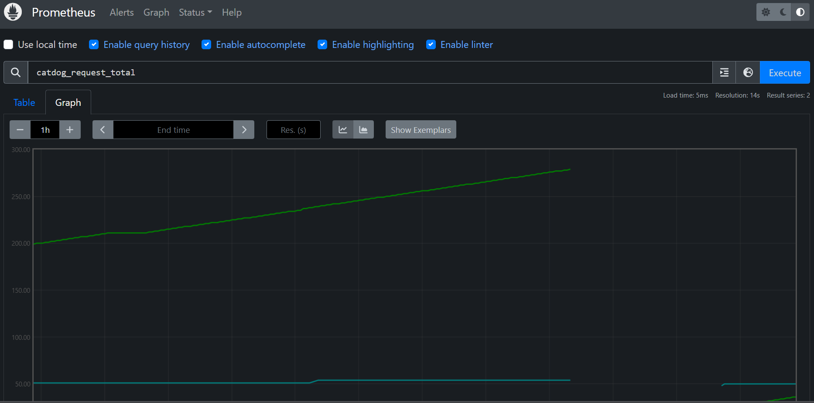
</div>

---

### 5.3 Post-Deployment Performance Tracking

**File:** `monitoring/simulate_requests.py`

Sends a batch of requests with known ground-truth labels and computes an accuracy report:

- Warm-toned (orange) images → labeled **"cat"**
- Cool-toned (blue) images → labeled **"dog"**
- Compares each prediction to its true label
- Saves a JSON performance report to `monitoring/performance_report.json`

```bash
python monitoring/simulate_requests.py --n 50 --url http://localhost:8000
```

**Sample output:**
```
  [01/50] true=cat  pred=cat  conf=0.8921  latency=38.2ms  ✓
  [02/50] true=dog  pred=dog  conf=0.9134  latency=35.7ms  ✓
  ...
=======================================================
  Post-Deployment Performance Report
=======================================================
  Overall Accuracy   : 94.0%  (47/50)
  Cat accuracy       : 25/25
  Dog accuracy       : 22/25
  Avg confidence     : 0.8834
  Avg latency        : 42.1 ms
  P95 latency        : 68.3 ms
=======================================================
  Report saved → monitoring/performance_report.json
```

<div style="border:1px solid #ccc; padding:10px; margin:20px 0; text-align:center;">
  <p><strong>Screenshot 22 — Post-Deployment Batch Simulation Output</strong></p>
  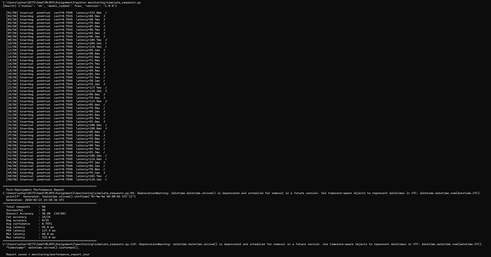
</div>

<div style="border:1px solid #ccc; padding:10px; margin:20px 0; text-align:center;">
  <p><strong>Screenshot 23 — Performance Report JSON</strong></p>
  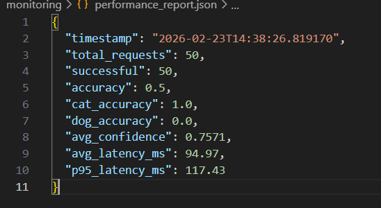
</div>

<div style="page-break-after: always;"></div>

---

## Tools & Technology Stack

| Category | Tool | Version | Purpose |
|---|---|---|---|
| **Language** | Python | 3.10 | All scripting and ML code |
| **ML Framework** | PyTorch | 2.2.0 | Model training and inference |
| **CV Library** | Torchvision | 0.17.0 | ResNet-18 backbone + transforms |
| **Image Processing** | Pillow | 10.2.0 | Image loading and preprocessing |
| **Experiment Tracking** | MLflow | 2.10.2 | Run tracking, metrics, artifact logging |
| **Data Versioning** | DVC | 3.40.1 | Dataset and pipeline versioning |
| **Web Framework** | FastAPI | 0.109.2 | REST API inference service |
| **ASGI Server** | Uvicorn | 0.27.1 | Production async server |
| **Monitoring** | Prometheus Client | 0.20.0 | Metrics exposition |
| **Monitoring** | Prometheus | 2.50.1 | Metrics scraping and storage |
| **Containerization** | Docker | latest | Image build and runtime |
| **Orchestration** | Docker Compose | v2 | Multi-service deployment |
| **CI/CD** | GitHub Actions | — | Automated test, build, deploy |
| **Container Registry** | GHCR | — | Docker image storage (`ghcr.io`) |
| **Testing** | pytest | 8.0.1 | Unit test framework |
| **Code Versioning** | Git | — | Source code version control |

---